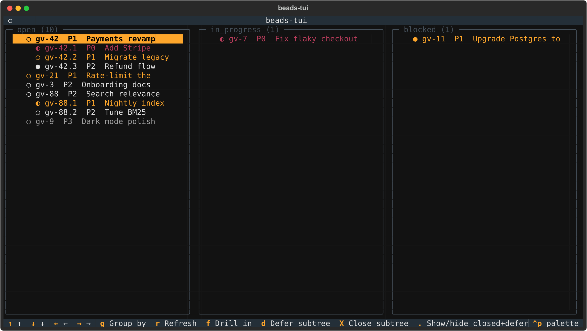
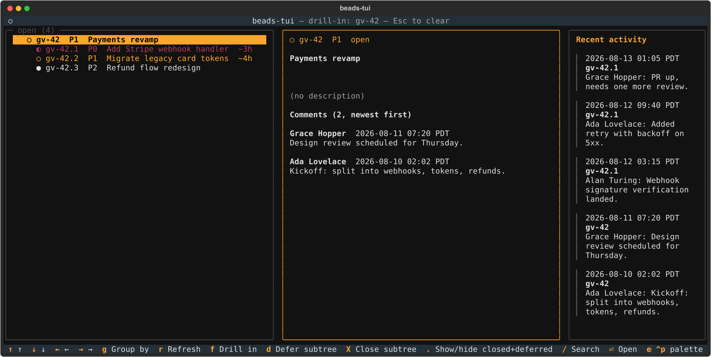

# bd-tui

A keyboard-driven **kanban TUI** for the [beads](https://github.com/gastownhall/beads)
(`bd`) issue tracker. Read-only for issue data, with two focused write actions:
**adding a comment** and **deferring / closing whole subtrees**.

Built with [Textual](https://textual.textualize.io/). Talks to your beads database
entirely through the `bd` CLI, so it works with whatever backend `bd` is configured
for.

## Screenshots

Kanban board — grouped by status, with epics and their subtasks:



Drill into a ticket (`f`) for a live detail pane plus a group **activity feed** of
the latest comments (click an entry to jump to that ticket):



_(Sample data.)_

## Requirements

- Python **3.10+**
- The **`bd`** CLI on your `PATH` (v1.2.2+ recommended — earlier versions have a
  comment-read bug on the Dolt backend)

## Install

Using [uv](https://docs.astral.sh/uv/) (recommended) or
[pipx](https://pipx.pypa.io/) — either installs `bd-tui` into its own isolated
environment:

```bash
uv tool install git+https://github.com/gevou/bd-tui.git
# or
pipx install git+https://github.com/gevou/bd-tui.git
```

One-liner:

```bash
curl -fsSL https://raw.githubusercontent.com/gevou/bd-tui/main/install.sh | bash
```

## Usage

```bash
bd-tui                    # columns grouped by status (default)
bd-tui --group priority   # or: label
bd-tui --poll 0           # disable the 15s auto-refresh
```

`bd-tui` finds your database the same way `bd` does (it walks up from the current
directory to a `.beads/`). If your database lives elsewhere, point at it with the
standard beads environment variable:

```bash
export BEADS_DIR=/path/to/.beads
```

## Keys

| Key | Action |
|-----|--------|
| `←/→/↑/↓` | Move the highlight between columns / cards |
| `Shift+←/→/↑/↓` | Extend a multi-selection |
| `Shift+click` | Toggle a card in the multi-selection (marked `◉`) |
| `Enter` / click | Open card detail (description + comments) |
| `c` | (in detail) Add a comment |
| `f` | Drill in: show only this ticket's descendants + dependencies. Adds a live **detail** pane (tracks the highlight) and an **activity** feed of the group's latest comments (click to jump to a ticket) |
| `d` | Defer / reopen — the multi-selection's subtrees if any are selected, else the highlighted ticket's subtree (confirms first) |
| `X` | Close as done — same target rules (confirms first) |
| `Esc` | Clear selection, then drill-in (or close a modal) |
| `g` | Cycle grouping: status → priority → label |
| `/` | Search (id / title / label) |
| `.` | Show/hide inactive issues (closed **and** deferred) |
| `r` | Refresh now |
| `q` | Quit |

Notes:
- The board auto-refreshes every 15s and only redraws when something actually
  changed (no flicker), keeping your highlighted card across refreshes.
- Closed and deferred issues are hidden by default; press `.` to reveal them.
- Comments display **newest-first** in your **local timezone**.

## Architecture

Three isolated, independently tested layers:

- `beads_tui/data.py` — the only place that shells out to `bd`
  (`list --json`, `comments --json`, `comments add`, `update`, `close`). Pure
  parsers + an injectable subprocess boundary.
- `beads_tui/model.py` — pure grouping / filtering / sorting / subtree logic.
- `beads_tui/app.py` + `widgets.py` — the Textual UI.

## Development

```bash
git clone https://github.com/gevou/bd-tui.git
cd bd-tui
uv venv && uv pip install -e . pytest pytest-asyncio
.venv/bin/python -m pytest        # no bd required — real JSON fixtures + a faked boundary
```

Or run straight from a checkout without installing: `./bin/bd-tui`.

## License

MIT — see [LICENSE](LICENSE).
